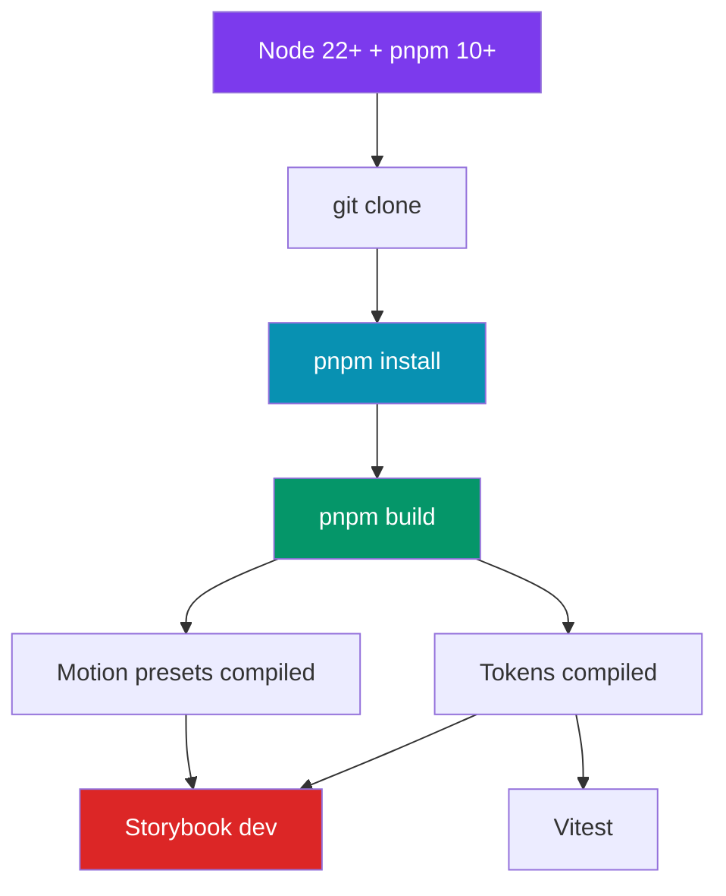

<!-- === SYSTEM PAIRING ===
Consumed by: AI sessions at first boot in this repo
Updated by: manual
Pairs with: AGENTS.md, CLAUDE.md, README.md, ../Portfolio/START_HERE.md (sibling)
Update trigger: first-run protocol change OR new boot prerequisite OR nd build pipeline change
Last verified: 2026-05-21 (initial creation — parity with mp's START_HERE.md)
Index: docs/SYSTEM-INDEX.md
=== END PAIRING === -->

# START HERE

> First file to read when starting work on `nectar-design`.
> **AI models:** Read this before AGENTS.md (canonical AI-builder config; CLAUDE.md is a pointer).
> **Humans:** Follow Quick Start, then read AGENTS.md.

Sibling: [`../Portfolio/START_HERE.md`](../Portfolio/START_HERE.md) (parent app).

---

## Quick Start (30 seconds)

```bash
# 1. Install deps
pnpm install

# 2. Build the token pipeline (5-tier compile)
pnpm build

# 3. Run tests + linters (matches CI)
pnpm test
pnpm exec tsc --noEmit

# All green? Read AGENTS.md next.
```

---

## Full Setup (New Machine)

```bash
# 1. System requirements
node --version    # Need 22+  (nvm install 22)
pnpm --version    # Need 10+  (npm install -g pnpm@latest)
git --version     # 2.40+

# 2. Clone — standalone, NOT via mp submodule
git clone https://github.com/tknatwork/nectar-design.git
cd nectar-design

# 3. Install + build
pnpm install
pnpm build         # Generates tokens.css (494 vars) + echarts theme + GSAP + Framer presets

# 4. Storybook dev
pnpm storybook     # http://localhost:6006

# 5. Tests
pnpm test          # Vitest — 353 tests across 6 specs
```

---

## What This Repo Is

Private design system for the Nectar Portfolio Platform. **5-tier token
pipeline** + **Biomimetic Adaptive Theme** (16 runtime CSS variables
computed from solar physics).

```text
primitives.json → seed.json → map.json → semantic.json → components/*.json
  → scripts/build-tokens-sd.mjs → css/tokens.css (494 CSS vars)
                                → dist/echarts-theme.json (light + dark)
  → scripts/build-motion-presets.mjs → dist/gsap/presets.js
                                     → dist/framer/variants.js
                                     → dist/animation-keyframes.css
```

| Tier | Count | Purpose |
| ---- | ----- | ------- |
| Primitives | 135 | Raw values (hex, px, cubic-bezier) |
| Seed | 19 | Brand decisions (colorPrimary, controlHeight) |
| Map | 96 | Derived via `color-mix(in oklch)` |
| Semantic | 87 | Aliases (spacing, typography, grid, motion, a11y) |
| Components | 77 (5 files: button, card, badge, input, glass) | Per-component tokens |
| Themes | 33 each (light, dark, high-contrast) | Theme overrides |

Total: **494 CSS custom properties** in `css/tokens.css`.

---

## Boot Dependency Order



---

## CLI Tools

| Tool | Version | Required | Install |
|------|---------|----------|---------|
| Node.js | 22+ | Yes | `nvm install 22` |
| pnpm | 10+ | Yes | `npm install -g pnpm@latest` |
| git | 2.40+ | Yes | Pre-installed (macOS) |
| gh (GitHub CLI) | Latest | Recommended | `brew install gh` |

---

## Ports

| Port | Service | Command |
|------|---------|---------|
| 6006 | Storybook dev server | `pnpm storybook` |

---

## Required Environment Variables

**None for local dev.** All tokens compile from JSON sources committed
to this repo — no API keys needed.

Optional (CI / publish flows):

| Variable | Source | Purpose |
|----------|--------|---------|
| `CHROMATIC_PROJECT_TOKEN` | Chromatic dashboard | Visual regression (currently paused — see `chromatic.yml` `if: false &&` gate) |

---

## Troubleshooting

| Problem | Cause | Fix |
|---------|-------|-----|
| `Cannot find module 'nectar-design'` (consumer side) | nd not built | Run `pnpm build` in this repo |
| `tokens.css` empty or stale | Build skipped | Re-run `pnpm build` |
| Test failure: `Cannot find module 'undici/lib/handler/wrap-handler.js'` | jsdom@29 vs undici@8 peer mismatch (mp issue — nd has no overrides) | Should not surface here. If it does, the override leaked from mp's lockfile somehow — file a cross-Claude issue. See [mp's dependency-upgrade.md → undici override-cap](../Portfolio/docs/runbooks/dependency-upgrade.md) |
| Storybook fails to start on port 6006 | Port in use | `lsof -i :6006 -t \| xargs kill` |
| `pnpm build` fails on `build-tokens-sd.mjs` | Token JSON syntax error or `color-mix` argument | Validate JSON: `node -e "JSON.parse(require('fs').readFileSync('tokens/<file>.json'))"`. For `color-mix`, see `scripts/build-tokens-sd.mjs` resolver logic. |

---

## CI Pipeline (mirror of mp's via parity)

PR-to-dev fires (see `.github/workflows/`):

| Workflow | Purpose |
|---|---|
| `ci.yml` | Build + Type Check (required) |
| `pr-readiness.yml` | Aggregator (required) |
| `semgrep.yml` | SAST (required) |
| `renovate-lockfile-armor.yml` | Lockfile auto-regen on Renovate PRs |
| `chromatic.yml` | Visual regression (PAUSED via `if: false &&` until quota reset) |
| `branch-sync.yml` | Weekly dev/main sync (Mon 06:00 UTC) |

---

## Dual-Clone Protocol (with mp)

This repo exists in **two places** on your machine:

| Clone | Path | Tracks | When you edit |
| ----- | ---- | ------ | ------------- |
| Dedicated (here) | `design-docs/nectar-design/` | `dev` | Design-system work. Branches, commits, PRs flow through this clone. |
| Submodule (in mp) | `design-docs/Portfolio/packages/nectar-design/` | Pinned SHA per mp's `.gitmodules` (always nd-main) | **Don't edit directly.** Updates via mp's submodule pointer bump after nd-main advances. |

Full protocol: [`../Portfolio/CLAUDE.md`](../Portfolio/CLAUDE.md) → "Dual-clone protocol for nectar-design".

---

## What to Read Next

1. **[AGENTS.md](AGENTS.md)** — Canonical AI-builder config. Full design-system architecture, conventions, token pipeline contracts.
2. **[README.md](README.md)** — Human-readable overview with token pipeline diagrams.
3. **[CONTEXT.md](CONTEXT.md)** — What we're building, what good looks like (if present).
4. **mp side:** [`../Portfolio/AGENTS.md`](../Portfolio/AGENTS.md) for parent-app context (how mp consumes nd's tokens).

---

## Common Commands Reference

```bash
# Build
pnpm build                 # Full pipeline: tokens + motion presets + types

# Develop
pnpm storybook             # Storybook dev server (port 6006)

# Test
pnpm test                  # Vitest run
pnpm exec tsc --noEmit     # Type check (no emit)

# Lint
pnpm lint                  # ESLint

# Release (Changesets workflow)
pnpm changeset             # Stage a changeset for unreleased changes
pnpm changeset version     # Apply staged changesets to package.json + CHANGELOG.md
```
