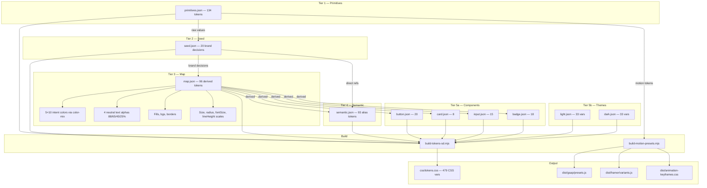

# Token Pipeline — 5-Tier Architecture



## Reference Chain Example

```text
--badge-primaryBg
  → var(--map-color-primary-Bg)
    → color-mix(in oklch, var(--seed-colorPrimary) 15%, white)
      → var(--seed-color-pastel-honey)
        → #FFE082
```

## CSS Output Structure

```css
@layer tokens {
  :root {
    /* Tier 1 Seed — raw primitives (--seed-*) */
    /* Tier 2 Map — derived (--map-*) */
    /* Tier 3 Semantic — aliases (--color-*, --spacing-*, ...) */
  }
  :root { /* Tier 4 Components (--button-*, --card-*, ...) */ }
  :root { /* Tier 5 Light theme */ }
  [data-theme="dark"] { /* Tier 5 Dark theme */ }
  @media (prefers-color-scheme: dark) { /* OS preference fallback */ }
}
```
